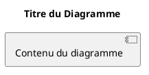

# 📖 README — Dossier Diagrammes PlantUML

## 🎯 Contenu du Dossier

Ce dossier contient tous les fichiers PlantUML pour le **Sprint 1** de FormaPro.

### Fichiers PlantUML (.puml)

```
Sprint1_1_CasUtilisation_Global.puml          → Diagramme d'activité globale
Sprint1_2_CasUtilisation_Utilisateur.puml     → Cas d'utilisation utilisateurs
Sprint1_3_CasUtilisation_Admin.puml           → Cas d'utilisation administrateur
Sprint1_4_Sequence_Authentification.puml      → Séquence du login
Sprint1_5_Sequence_Inscription.puml           → Séquence du signup
Sprint1_6_Sequence_GestionFormateurs.puml     → Séquence création formateur
Sprint1_7_Activite_Authentification.puml      → Flux d'authentification
Sprint1_8_Classes.puml                        → Diagramme de classes
Sprint1_9_Activite_CreationFormateur.puml     → Flux création formateur
```

### Script de Génération

```
GENERER_DIAGRAMMES.bat   → Script pour générer tous les PNG automatiquement
```

---

## ⚡ Démarrage Rapide

### Option 1 : Génération Automatique (Recommandé)

```bash
1. Télécharger PlantUML :
   https://sourceforge.net/projects/plantuml/files/

2. Placer plantuml.jar dans : C:\PlantUML\

3. Double-cliquer : GENERER_DIAGRAMMES.bat

4. Les PNG sont générés automatiquement dans : Images_Sprint1/
```

### Option 2 : Génération Online (Sans Installation)

```
1. Aller sur : https://www.plantuml.com/plantuml/uml/

2. Ouvrir un fichier .puml avec un éditeur de texte

3. Copier le contenu dans PlantUML Online

4. Télécharger l'image PNG
```

### Option 3 : VS Code Extension (Temps Réel)

```
1. Installer extension : "PlantUML" (jebbs.plantuml)

2. Ouvrir un fichier .puml

3. Ctrl+Shift+P → "PlantUML: Export Diagram"

4. Choisir PNG et localisation
```

---

## 📊 Diagrammes Disponibles

| # | Nom | Type | Utilité |
|---|-----|------|---------|
| 1 | Global | Cas d'utilisation | Vue d'ensemble du système |
| 2 | Utilisateur | Cas d'utilisation | Détail des fonctionnalités utilisateurs |
| 3 | Admin | Cas d'utilisation | Détail des fonctionnalités admin |
| 4 | Authentication | Séquence | Processus de login complet |
| 5 | Inscription | Séquence | Processus d'enregistrement complet |
| 6 | Formateurs | Séquence | Processus de création formateur |
| 7 | Activité Auth | Activité | Flux décisionnel authentification |
| 8 | Classes | Classes | Structure et relations entités |
| 9 | Activité Formateur | Activité | Flux décisionnel création formateur |

---

## 🛠️ Personnalisation

Pour modifier un diagramme :

1. Ouvrir le fichier `.puml` avec un éditeur de texte
2. Modifier le contenu selon la syntaxe PlantUML
3. Régénérer l'image

**Ressources PlantUML :**
- 📚 Guide complet : https://plantuml.com/guide
- 🎨 Diagrammes : https://plantuml.com/class-diagram
- 💡 Exemples : https://plantuml.com/en/activity-diagram-beta

---

## ✅ Checklist d'Utilisation

- [ ] PlantUML téléchargé et placé dans C:\PlantUML\
- [ ] Script GENERER_DIAGRAMMES.bat exécuté
- [ ] Dossier Images_Sprint1 créé avec PNG
- [ ] PNG intégrés dans le rapport Word
- [ ] Captions (Figures) ajoutées pour chaque diagramme
- [ ] Descriptions rédigées dans le rapport

---

## 📝 Format des Fichiers

### Structure PlantUML :


### Exemple d'extension :
```plaintext
nom_fichier.puml   → Code source PlantUML
nom_fichier.png    → Image générée (à partir du .puml)
nom_fichier.pdf    → Exportable aussi en PDF
```

---

## 🐛 Dépannage

### Problème : "PlantUML JAR not found"
**Solution :**
```
1. Télécharger depuis : https://sourceforge.net/projects/plantuml/files/
2. Créer dossier : C:\PlantUML\
3. Y placer le fichier : plantuml.jar
```

### Problème : "Java not found"
**Solution :**
```
1. Télécharger Java 8+ : https://www.java.com/
2. Installer et relancer le script
```

### Problème : "GraphViz not found"
**Solution :**
```
1. Télécharger GraphViz : https://graphviz.org/download/
2. Installer et relancer
```

### Problème : "PlantUML Online trop lent"
**Solution :**
```
Utiliser Option 1 (Installation locale) pour plus de rapidité
```

---

## 📤 Integration au Rapport

1. **Générer les PNG** (une des 3 options ci-dessus)
2. **Créer dossier** : `images_rapport/`
3. **Copier les PNG** dans ce dossier
4. **Ouvrir rapport Word**
5. **Insérer → Image** et sélectionner les PNG
6. **Ajouter captions** : "Figure X : Titre"
7. **Redimensionner** et centrer si nécessaire

---

## 📞 Support

**Questions sur PlantUML ?**
- 📖 Documentation : https://plantuml.com
- 🤔 Stack Overflow : plantuml tag
- 💬 Forum PlantUML : https://forum.plantuml.net

**Besoin d'aide pour l'intégration ?** Contactez votre responsable ou utilisez les templates fournis.

---

## 🎓 Exemple d'Intégration dans le Rapport

```
III. Conception

1. Diagrammes de cas d'utilisation

[IMAGE : Sprint1_1_CasUtilisation_Global.png]

Figure 8 : Diagramme de Cas d'Utilisation Global — Sprint 1

Description : Ce diagramme présente une vue générale 
des acteurs et de leurs interactions avec le système...

1.1 Raffinement utilisateur

[IMAGE : Sprint1_2_CasUtilisation_Utilisateur.png]

Figure 9 : Raffinement — Cas d'Utilisation Utilisateur

Description : Ce diagramme détaille les cas d'utilisation 
disponibles pour les utilisateurs non-administrateurs...
```

---

**Bon travail ! 🚀 Les diagrammes sont prêts à être générés et intégrés.**
